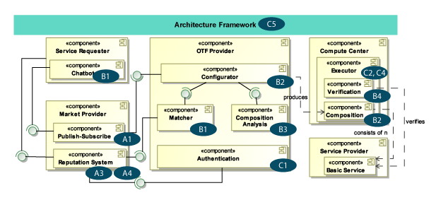
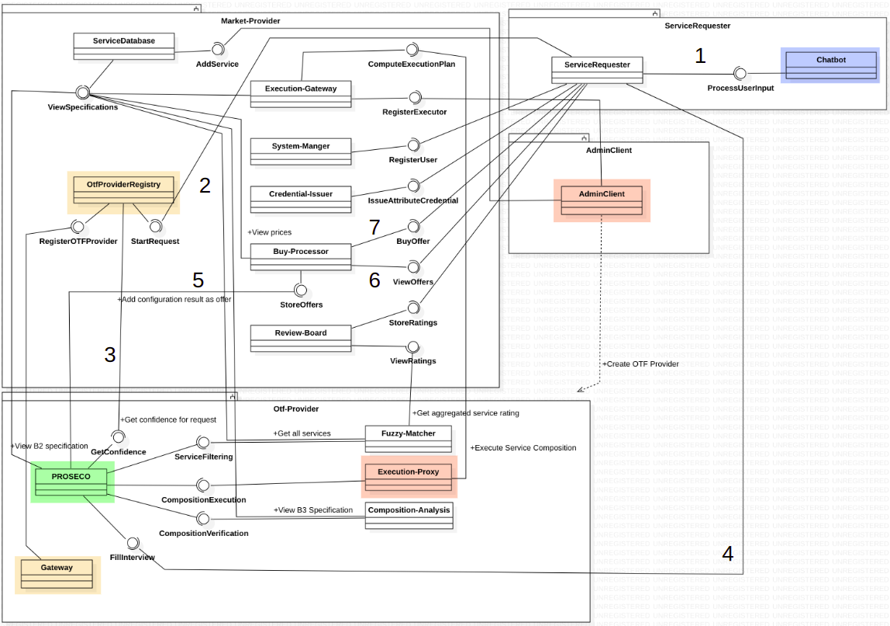
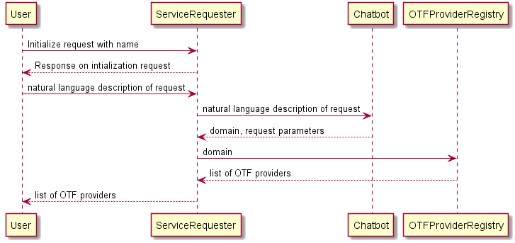
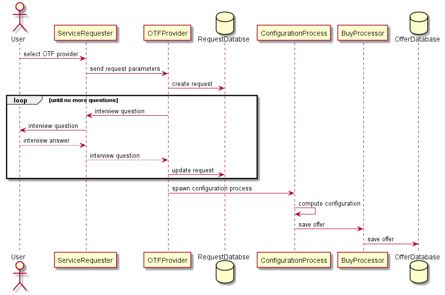
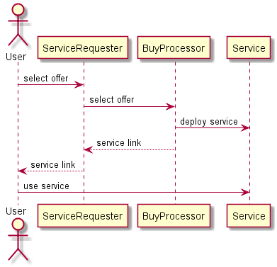

## Architecture

- **A1** - Self-stabilizing publish-subscribe system for market and OTF provider

- **A3, A4** - Concepts for the reputation system for the rating of service compositions [TODO later] this is currently only realized on a VERY basic level - how to deal with that?

- **B1** - Chatbot for a user-friendly requirements specifications and a matcher for matching non-functional requirements

- **B2** - Configurator for service composition using heuristic search

- **B3** - Verification of functional properties within operation sequences

- **B4** - Certification and validation of functional properties of basic services

- **C1** - Authentication of ratings, authorization for buying service compositions and their access control

- **C2, C4** - Deployment of basic services in Compute Centers and the execution of service compositions in heterogeneous computing environments

- **C5** - Conformance checking of the Proof-of-Concept architecture with the On-the-Fly architecture framework

### Component diagram

### Sequence diagrams

#### 1. Create Request

The first step is to request for a service. User can do that through the chatbot interface and ask for a initial request. The request is forwarded to ServiceRequester and ServiceRequester respond on the request and ask for more parameteres (domain, details, natural language descriptios). When user provide the domain anme, necessary and relevant description through chatbot, that domain is registered then in OTFProviderRegistry. OTFProviderRegistry then check and return the list of the available OTF providers to the ServiceRequester. ServiceRequester then send that list to the user. This way a request can be created. The next step is execute that request which is described in the next subsection.

#### 2. Execute Request

When the request is created (see the Create Request section). OTFProvider ask user severalinterview questions on the request to get a clear idea about the request. User can only interact with ServiceRequester. OTFProvider ask these interview questions to the ServiceRequester and ServiceRequester pass these questions to the user and vice-versa. When OTFProvider have the proper idea on the request it starts execute the request by doing spawn configuration process for the request and sent this configuration to the Configuration Process. ConfigurationProcess is responsible to compute the configuration for the requested service and generate the offer for the specific service and save it to the OfferDatabase. The following sequence diagram shows the steps of a request being executed.

#### 3. Buy an Offer

At the third step the generated offers of different OTFProviders are showed to the user. User select an offer and send to the ServiceRequester. ServiceRequester forward the choice to the BuyProcessor service. The BuyProcessor then deploy the servcie using Service component and generate a service link for that service and send back the link to the ServiceRequester. ServiceRequester provide the link to the user and thus user can access the service. 

### Deployment diagram

To be Added
[TODO Panneer] we need to make sure that the deployment diagram is on a "non-UPB-specific" level