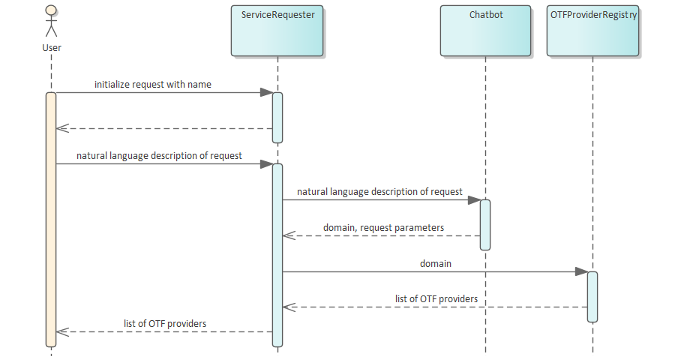
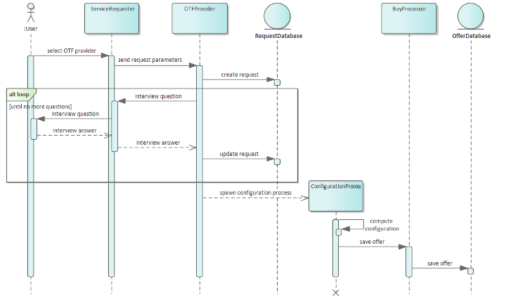
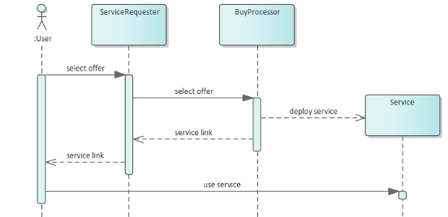

# General information

The PoC is based on a microservice architecture, i.e., its functionality is provided by several components which communicate via REST interfaces to realize more complex tasks. These components are packaged as Docker containers and deployed to a Kubernetes cluster.

# Most important Components
In the following, all implementations are relative to the `Testbed` git.

- Web UI
  - Interface to the user. Translates user inputs into calls to the Service Requester and responses into Ui changes.
  - Technologies: Angular, JavaScript, CSS
  - Implementation: ``website\WebContent``
- Service Requester
  - Most important service: Orchestrates the creation of a user request for an AI service, and thus communicates with most other services.
  - Technologies: Java, REST/OpenAPI
  - Implementation: ``local_client\service_requester_new``
- Chatbot
  - Tries to understand the user's input and translate it into a formal specification (e.g., it understands that the user wants to perform image classification from the user's input in natural language).
  - Technology: Docker container Chatbot (black box, internally: Python)
- OTFProviderRegistry
  - Knows about all different OTF providers of the system (currently: only one).
  - Technologies: Java, REST/OpenAPI
  - Implementation: ``market_provider\otfp_registry_new``
- OTFProvider
  - Is selected by the user based on the suggestions of the Service Requester. Will then perform an interview with the user to gather missing information, and then triggers the creation of the final service.
  - Technologies: Java, REST/OpenAPI
  - Implementation: ``otf_provider\proseco_configurator``
- ConfigurationProcess
  - Does the actual creation (in OTF terms: configuration) of the final service and then offers the finished service to the Buy Processor
  - Technology: Docker container Proseco (black box, internally: Java)
- Buy Processor
  - Handles the created offers via the OfferDatabase; if the user selects an offer and thus buys the corresponding service, that service is deployed, and the URL for accessing the service is made available to the user
  - Technologies: Java, REST/OpenAPI
  - Implementation: ``market_provider\buy_processor``
- RequestDatabase
  - stores requests processed by OTF Providers
  - Technology: PostgreSQL
- OfferDatabase
  - stores offers created as result of requests
  - Technology: PostgreSQL

# From user request to deployed service

The following sequence diagrams show the basic flow of information which is taking place during handling a user request.

## Creation of request

The user starts creation of a service by providing a name for the service as well as a natural language description of the service's purpose (e.g., "I want my service to be able to recognize certain objects on my images"). The user input is then passed to the Chatbot which tries to understand the description, identifies the domain of the request (e.g., "image classification"), and returns a formalization of its understandings to the Service Requester. The identified domain is then passed to the OTF Provider Registry, which returns the available OTF Providers for that domain. These are presented to the user, and she will make her selection (e.g., based on the reputation of the respective OTF Providers).

## Execution of request

Next, the formalized parameters that had earlier been extracted by the Chatbot are passed to the selected OTF Provider. The OTF Provider will then register the user request within the Request Database. Now, the domain knowledge of the OTF Provider comes into play: Based on the passed parameters, the OTF Provider will conduct an interview with the the user and gather the missing information it needs to be able to create a meaningful service (e.g., it might ask how long it is allowed to spend on searching for an appropriate ML solution). If all necessary information is gathered, the request will be updated in the Request Database, and the actual creation of the service is started by spawning a Configuration Process. As soon as the creation of the service has been finished, an according offer will be sent to the Buy Processor, which will save that offer in the Offer Database.

## Buying an Offer

Finally, in case the user selects an offer and thus buys the offer's service, that service is deployed by the Buy Processor, and a service link is provided to the user, which she can then use to access her service (and e.g. upload images which the service might then tag with the objects it has recognized on the images).
