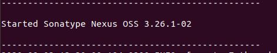

# Technology Used
* Containeraization : Docker is used for the containeraization technique.
* Container Management : To manage the huge number of Docker PoC is using Kubernetes. All the componenets are ultimately executed in the Kubernetes.
* Continuous Integration (CI) : Jenkins is used as the Continuous Integration tool. Jenkins is configured such way When a changes take place in the Git, Jenkins auto recognize the changes and build the responsible and dependent section.
* Quality Assurance: To ensure the code quality we are planning to use SonarQube which will be implemented soon.


[TODO Panneer] Is it possible to provide a step-by-step explanation of how to set up the PoC from scratch? It might also help with structuring this file, since the order of information is coming naturally. This might be quite a bit of work, but will probably be very helpful to our users... Let's try to lower the entry barrier as much as possible.

One proposal would be to do this in two parts:
1. [TODO Panneer] Explain which machines are needed with which components. That's all people need if they know the technologies
2. (Describe in detail how each machine should be set up) [probably later]

[TODO all] General comment: Currently, this file contains a sequence of very technical information. To improve readability, we need to make more of a document out of this, e.g. by providing short introductions to each section (with slightly more detail than above).

# Docker Tasks

- docker : Builds Docker image
- dockerClean : Cleans Docker build directory
- dockerfileZip : Bundles the configured Dockerfile in a Zip file
- dockerPrepare : Prepares Docker build directory
- dockerPush : Pushes named Docker image to configured Docker Hub
- dockerPushDate : Pushes the Docker image with tag 'nexus.cs.upb.de/sfb901-testbed/admin_client:2020-05-01T08_37_54' to configured Docker Hub
- dockerPushLatest : Pushes the Docker image with tag 'nexus.cs.upb.de/sfb901-testbed/admin_client:latest' to configured Docker Hub
- dockerPushVersion : Pushes the Docker image with tag 'nexus.cs.upb.de/sfb901-testbed/admin_client:unversioned' to configured Docker Hub
- dockerTag : Applies all tags to the Docker image
- dockerTagDate : Tags Docker image with tag 'nexus.cs.upb.de/sfb901-testbed/admin_client:2020-05-01T08_37_54'
- dockerTagLatest : Tags Docker image with tag 'nexus.cs.upb.de/sfb901-testbed/admin_client:latest'
- dockerTagsPush : Pushes all tagged Docker images to configured Docker Hub
- dockerTagVersion : Tags Docker image with tag 'nexus.cs.upb.de/sfb901-testbed/admin_client:unversioned'

### Jenkins build
* Introduction: Jenkins is a way to set up continuous integration (CI) environment for the source code repositories using pipelines. Jenkins can be configured in a such way so that it relaize all the changes in the code and execute the auto build for the changes after doing the tests.

* Build Process: Under every componenet there is a jenkins file which tells what to do (run docker etc.) when a build will run on that component. First we create a new job and tell Jenkins the path of the jenkinsfile (e.g. Github / Gitlab). This is also needed how this job will build. We can manually login to the jenkins and build the job. Other way is we can tell the jenkins to build the job at a specific time. The third way is to configure the job and the pipelines such Jenkins will auto build the jobs and the depended jobs when there is a push in the Git. 
[

### SonarQube

NOTE: Could be first task for new DevOps developer

# Nexus Repository Manager (NXRM)


### Installation in Linux

- Download Nexus Repository Manager 3 zip file from [here](https://help.sonatype.com/repomanager3/download). Select Unix as Operating System.
- open a terminal and make a new directory named "data"
  ```sh
  mkdir data
  ```
- go to the directory the zip file was downloaded move it to the new directory
  ```
  mv nexus-<version>.<ext> /data/
  ```
- go to the installation directory
  ```
  cd /data
  ```
- extract the zip file

  ```
  tar -xf nexus-<version>.<ext>
  ```

- Run Nexus

  ```
  ./bin/nexus run
  ```

  Add `sudo` if needed. If the installation is succesfull then the following output will come in the terminal <br/>
  
  Normally, NXRM runs on 8081 port.

  [TODO all] This is quite detailed, but I like it. However, we need to make sure that all descriptions are on the same abstraction level (i.e., other descrptions should be raised to this abstraction level where appropriate)

**Installation Directory of NXRM**

- /data/nexus-3.22.1-02/
- ├── bin
- ├── deploy
- ├── etc
- ├── lib
- ├── public
- └── system <br>

**Data Directory of NXRM**
/data/sonatype-work/nexus3/

- ├── backup
- ├── blobs
- ├── cache
- ├── db
- ├── elasticsearch
- ├── etc
- ├── generated-bundles
- ├── health-check
- ├── instances
- ├── kar
- ├── keystores
- ├── log
- ├── orient
- ├── restore-from-backup
- ├── tmp
- ├── tmp_backup
- └── upgrades

### Run As a Service

The nexus application starts with `/data/nexus-3.22.1-02/bin/nexus start`, but we don't want to start it manually everytime the VM went down. That is why we created a service, that gets executed automatically after bootup. You have multiple ways of realizing this. We used systemd in our case. It is a good practise to create a new user on the vm, that only owns the needed folders for executing the application, which are `/nexus-<version>` and `/sonatype-work`. We called him `nexususer` and gave him all the rights. Next enter the user in `/nexus-3.25.1-04/bin/nexus.rc` between the quotes. Now we can create a file `nexus.service` in `/etc/systemd/system/` with the content shown in the link above. Be sure to adapt the `User` and and the path for `ExecStart` and `ExecStop`.
With

```
 sudo systemctl daemon-reload
 sudo systemctl enable nexus.service
 sudo systemctl start nexus.service
```

you enable and start the service.
And with
`sudo systemctl status nexus.service`
you can check if it is running properly.

# Nginx as Reverse Proxy

### Installation

We followed this guide [TODO which guide? :-)] for installation for a debian 9 system, because this the OS our VM is running. After finishing these steps, the installation directory should be /etc/nginx.

### SSL-Certificates

To ensure safety, we want to encrypt all incoming requests. Therefore a valid ssl-certificate is needed. This can be self-signed or by an external authority. The second option can only be done by the IRB, if the VM is only reachable in the Network of the University. Our certificates are signed by DFN and maintained by the IRB. They are located in /etc/ssl/private.

[TODO Rabbi, Panneer reviews] good explanation, but let's try to keep it UPB independent!

### Configuration

All needed tweaks and configuration can be done in the config file nginx.conf located in the installation dir. In our case we want to hide the nexus repository manager behind a reversed proxy that listens at ports 443 (ssl) of the domain nexus.cs.upb.de and redirects all incoming requests to the nexus, that itself is listening at port 8080 most commonly.
A valid configuration is shown here in their last example. Make sure all the parameters like the server_name or the path to the ssl_certificate are adapted.

# All servers (VMs)
[TODO Panneer] This should probably go into the Wiki - here we could come up with a description of how many VMs are needed, which purpose they have, any specific requirements (e.g. memory) etc.


| Server                      | URL                                             |
| --------------------------- | ----------------------------------------------- |
| Git                         | https://git.cs.upb.de/SFB901-Testbed/           |
| Jenkins Build Server        | sfb-jenkins.cs.upb.de                           |
| Nexus                       | https://nexus.cs.upb.de/                        |
| Old Nexus                   | https://nexus-old.cs.upb.de/                    |
| Kubernetes Testsystem       | http://sfb-k8master-1.cs.uni-paderborn.de:30570 |
| MongoDB                     | mdb-master.cs.upb.de                            |
| Kubernetes Productivesystem | sfb-k8master-1.cs.upb.de                        |
| Kubernetes Node             | sfb-k8nodes-1.cs.upb.de                         |
| Kubernetes Node             | sfb-k8nodes-2.cs.upb.de                         |
| Kubernetes Node             | sfb-k8nodes-3.cs.upb.de                         |
| Kubernetes Node             | sfb-k8nodes-4.cs.upb.de                         |

To get in touch with our system, we started in February 2020 some Test VMs where Saman and Jan-Niclas set up the system from scratch

| Server                    | URL                       |
| ------------------------- | ------------------------- |
| Kubernetes Main test node | test-master-1.poc.upb.de  |
| Kubernetes Test Node      | test-worker-1.poc.upb.de  |
| Jenkins Testserver        | test-jenkins-1.poc.upb.de |
| Nexus Testserver          | test-nexus-1.poc.upb.de   |

Because Jenkins and Nexus are available as docker the idea was to test, how well they will perform inside of the kubernetes cluster
Most of the Servers are Virtual Machine and administrated by the IRB
To see what Virtual Machines we have we can go to the [VSphere Client](https://vsc.cs.uni-paderborn.de/), there we can also restart Servers.

### Databases

### Docker containers
List of "high-level" containers

### Kubernetes

#### Set up Kubernetes configuration

#### Helm

#### Blades
