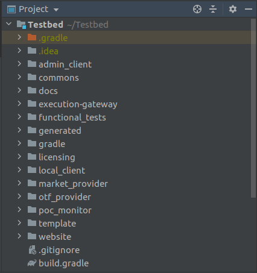

## Development

### Project structure

You will get the below project structure on importing the Testbed
project

into intellij(Recommended)

[NOTE:- Later on in the docs you will get the steps to make the project

importable into intellij]

### How to build

*	Considering you have set up your gradle, go to the Testbed folder and
	in terminal use the command “gradle tasks” or “./gradlew tasks”(if
	gradle is not configured or correctly installed)

*	In terminal run command “./gradlew eclipse” or “./gradlew
	idea”(Recommended) to make the project importable for eclipse or
	intellij respectively.

*	After importing the project in your respective IDE, you can further
	make changes in the build.gradle file( like adding additional
	dependencies). For building a project(Specific to Intellij), from the
	main menu, select **Run** | Edit Configurations to open the
	**run**/debug configuration for the **project**. In the list that opens,
	select **Run Gradle** task. In the Select **Gradle** Task dialog,
	specify the **project** and the task that you want to **execute** before
	launching the **project**.

### How to run

*	You can run the project like this “./gradlew project_name:run”,
	which project_name is the name of the sub-project.

	For Example with some environment variables:-

	“RABBIT_MQ_USERNAME='arandomuser'
	RABBIT_MQ_PASSWORD='arandompassword' RABBIT_MQ_PORT='5672' ./gradlew
	service_requester_new:run”

#### Set up Gradle configuration

*	Install Gradle into your Linux System(Recommended)

	[Useful Link :- <https://gradle.org/install/>]

*	Copy the “gradle.properties” file, which will be provided to you by a
	member of the Testbed team, in the location (\$Home)/.gradle

*	Your Gradle should be configured

### How to develop

#### Server components

##### Java/Spring

#### REST APIs

##### OpenAPI/Swagger

#### Web UI

##### Angular/Typescript

*	Install nodejs here <https://nodejs.org/en/download/>

*	Use the command " node -v " for nodejs or " npm -v " for npm to check 
	if installation is correctly done.

*	Install the latest version of angular-cli using the command " npm 		install -g @angular/cli "

*	Open a terminal and go to folder Testbed and checkout the branch " 		feature/develop"

*	Then go to folder "website/WebContent" present inside Testbed and run 		the command " npm install "(Please check before if Package.json is 		contained within it).

*	For Running the project use command " ng serve --open "

#### Debugging
