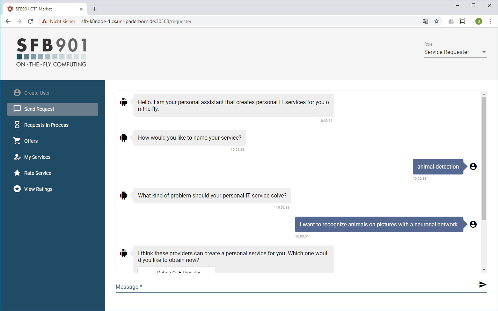
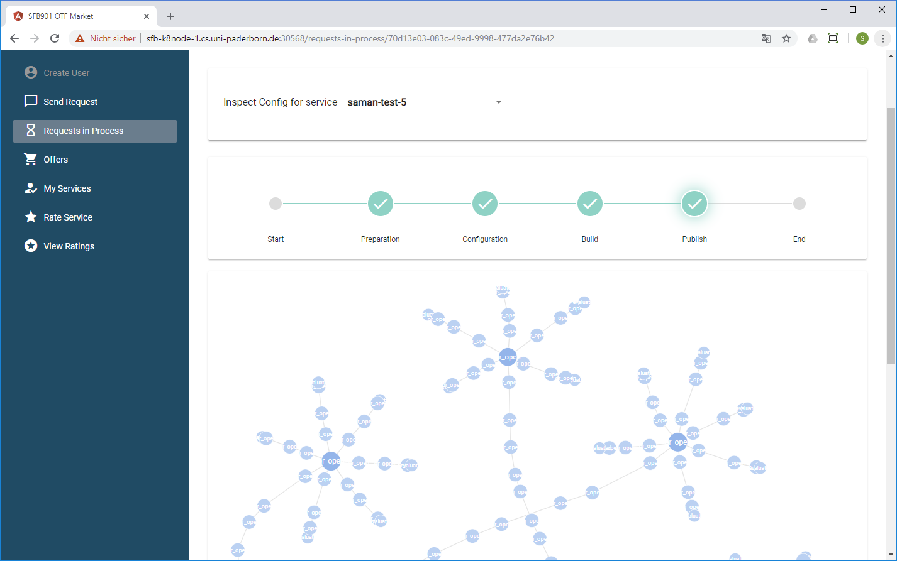
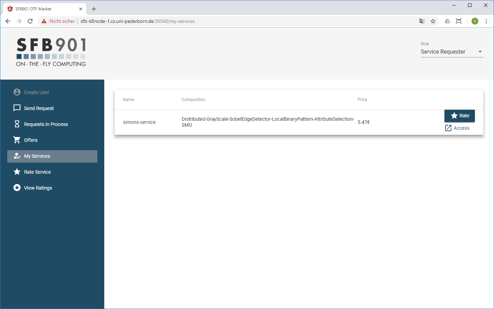
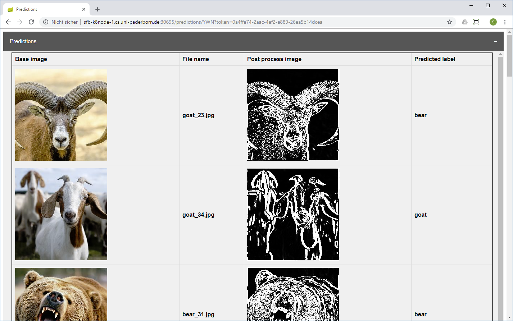
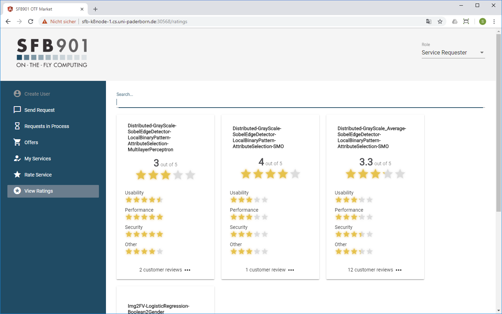

# Deploying the POC

This document describes how to deploy the POC's microservices to an existing Kubernetes cluster.

## Prerequisites

* A working Kubernetes cluster with at least two nodes (master + worker)
* ssh access to the (virtual) machines that the cluster is running on
* Superuser (``sudo``) permissions
* The Kubernetes client (``kubectl``) is installed on your development machine
* Debian, Ubuntu or similar Linux system is running on the cluster
* A kernel that supports [cgroups](https://en.wikipedia.org/wiki/Cgroups) v1 - version 2 will generally *not* work

If you don't have a cluster set up, you can use the Ansible script (https://github.com/CRC-901-On-the-Fly-Computing/Ansible-k8cluster) we created for this purpose. Please note that it was developed for internal use only and may or may not function as expected in other environments.

## Overview

These are the steps necessary for a successful deployment:

1. Setting up the POC services using Helm and Tiller
2. Installing PostgreSQL on the cluster
3. Populating the PostgreSQL database
4. Deploying the backend (Java-based microservices)
5. Deploying the frontend (NodeJS app)

You should then be able to request the creation of machine learning services via the frontend.

## Preparing the Deployment via Helm Charts

To make it easier for you to set up the various microservices of the POC, we provide Helm charts in a [separate repository](https://github.com/CRC-901-On-the-Fly-Computing/Helm-Charts.git).

To make use of these helm charts, login to your master node and perform the following steps:

* ``git clone https://github.com/CRC-901-On-the-Fly-Computing/Helm-Charts.git``
* ``cd Helm-Charts``
* ``./helm_install_configure.sh`` (to create a Tiller user)
* To verify that it worked, enter ``kubectl get po -n kube-system`` (should see a pod called ``tiller-deploy``)
* ``./init_dependencies.sh`` (to update some required dependencies)
* ``./fill_passwords.sh`` (the passwords you enter are used to configure the deployment)
   1. The Nexus credentials must match the values stored in [gradle.properties](../gradle.properties)
   2. For other prompts (rabbitmq, requestdb, reputationdb, and offerdb) the inputs don't matter, and can be set to placeholders like ``test123``

## Deploying PostgresSQL

* Update the name of the master node in ``tools/postgres/Values.yml``
* Set ``autoconfig: false`` in ``poc/market_provider/values.yaml``
* ``cd tools/postgres`` and run the ``install.sh`` script
* The script will deploy postgresql to your cluster
* You can verify the pod is running by typing ``kubectl get po -n postgres``

## Populating the PostgresSQL database

You can use a Swagger API to initialize the postgres database:

* Navigate to the Swagger API located at hostname:30302/api (Example: ``http://masternode.example.org:30302/api``)
* Send a POST request to the **code_provider_registry** using [this JSON](assets/code_provider_registry_new.json) as request body
* Send a POST request to the **service_registry** using [this JSON file](assets/postgres_service_registry.json)

Simply copy/paste the file contents as request body.

The response should be ``200 OK`` in each case.

Afterwards, you can send GET requests to the same API (using the Swagger UI) and verify that the list of services now contains the objects from those JSON files.

## Deploying the Backend Applications

* Edit ``poc/market_provider/values.yaml`` and set ``autoconfig: false``, then update the name of the hostname (master node) 
* ``cd`` into each of the following directories and run the ``install.sh`` script:
  1. ``poc/market_provider``
  1. ``poc/otf_provider``
  1. ``poc/execution``
  1. ``poc/service-requester``
* After each step, you might want to run ``kubectl get po -A`` and verify a new pod is running before proceeding with the next script  
* Initialize specific executors via the Swagger API
  1. Navigate to the Swagger API located at ``hostname:31527/api/swagger-ui.html#/ExecutorSpawner/spawnExecutor``
  2. Send a POST request to the executor spawner using contents from [this file](assets/execution_spawner_service_list.txt) as request body
  3. Wait until the process finishes
  4. You can verify that it worked by checking ``hostname:30370/cmd/executors/ls/services` (the services must be listed here)
    
## Deploying the Frontend Application

* ``cd`` into ``poc/website`` and run the ``install.sh`` script
* This will install the frontend on your cluster

## Testing the Deployment

1. Navigate to the website URL ``hostname:30568/`` in your browser
1. Name your service with any desired name
1. Now you can request a service using the "Image-classification" 
1. Select the otf-provider
1. Select first market provider 
2. Upload the [provided training file](assets/train_bear_frog_goat.zip)
3. Give the desired timeout (e.g., ``600`` = 600 seconds)
4. Now your requested service will be created and you can see the progress on the /requests page
5. Once the request page shows that the process has completed, navigate to the offers page and select ("buy") an offer
6. The POC will build and deploy this service for you, and once the state changes from 'booting' to 'running', you can access the requested service

## Sample Runthrough
The following screenshots illustrate a successful purchasing process:

User describes the properties of the desired solution:

The solution is computed, some visual feedback is provided to the user:

The solution has been computed and provisioned - it can now be accessed by the user:

The deployed web application through which the solution can be accessed:

User can rate their solutions:

